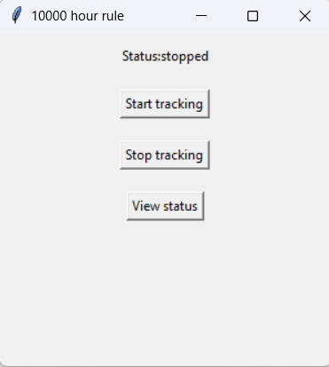
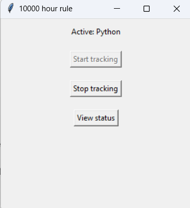
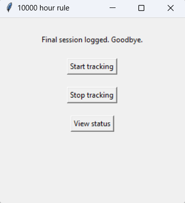
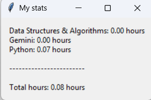

# 10,000 Hour Tracker

A simple Python desktop application to automatically track the time spent on various skills, inspired by the "10,000-hour rule."

This app runs in the background, detects your active window or browser tab, and classifies the activity into a predefined topic (e.g., "Python," "Django," "Data Structures"). All time is logged to an Excel file, and you can view a summary of your progress at any time.

### Application Showcase

<table>
  <tr>
    <td align="center"><b>Status: Stopped</b></td>
    <td align="center"><b>Active: Python</b></td>
  </tr>
  <tr>
    <td></td>
    <td></td>
  </tr>
  <tr>
    <td align="center"><b>Final Session Logged</b></td>
    <td align="center"><b>Showing My Statistics</b></td>
  </tr>
  <tr>
    <td></td>
    <td></td>
  </tr>
</table>

## Features

* **Simple GUI:** A clean interface built with Tkinter to Start, Stop, and View tracking.
* **Background Tracking:** Uses multi-threading to run the tracker in the background without freezing the GUI.
* **Automatic Idle Detection:** Stops tracking if you are away from the keyboard or mouse for a set period.
* **Smart Topic Classification:** Maps active process names (e.g., `pycharm64.exe`) or window titles (e.g., "LeetCode") to specific, customizable skills.
* **Excel Logging:** Automatically logs all sessions to `data/10000_hour_log.xlsx`.
* **Time Aggregation:** Intelligently groups all time spent on the same topic into a single entry for each day.
* **Analytics Dashboard:** A "View Stats" pop-up window shows a summary of total hours logged for each skill.

## Technologies Used

* Python 3
* **GUI:** Tkinter
* **Logging & Analytics:** Pandas
* **Activity Detection:** psutil, pywin32
* **Background Processing:** Threading

## Installation & Setup

1.  **Clone the repository:**
    ```bash
    git clone [https://github.com/SAPNIL-M/10000_hour_app.git](https://github.com/SAPNIL-M/10000_hour_app.git)
    cd 10000_hour_app
    ```

2.  **Create and activate a virtual environment (Recommended):**
    ```bash
    # On Windows
    python -m venv .venv
    .venv\Scripts\activate
    
    # On macOS/Linux
    python3 -m venv .venv
    source .venv/bin/activate
    ```

3.  **Install the required libraries:**
    ```bash
    pip install -r requirements.txt
    ```

## How to Use

1.  **Run the application:**
    ```bash
    python main.py
    ```
2.  Click the **"Start Tracking"** button to begin monitoring your activity. The tracker will run in the background.
3.  Click the **"View Stats"** button at any time to see a pop-up summary of your logged hours per topic.
4.  Click the **"Stop Tracking"** button to safely stop the tracker. Your final session will be logged.

## How to Customize

You can easily customize the skills and keywords you want to track.

Open the `tracker/topic_classifier.py` file and edit the `TOPIC_MAP` dictionary. Add your own topics and a list of keywords (from process names or window titles) that should trigger the tracker.

```python
TOPIC_MAP = {
    # Topic Name: [list of keywords]
    'Python': [
        'python', 
        'pycharm64.exe', # IDE
        'code.exe'       # VS Code
    ],
    'My New Skill': [
        'some_app.exe',
        'a_keyword_in_a_tab_title'
    ]
}